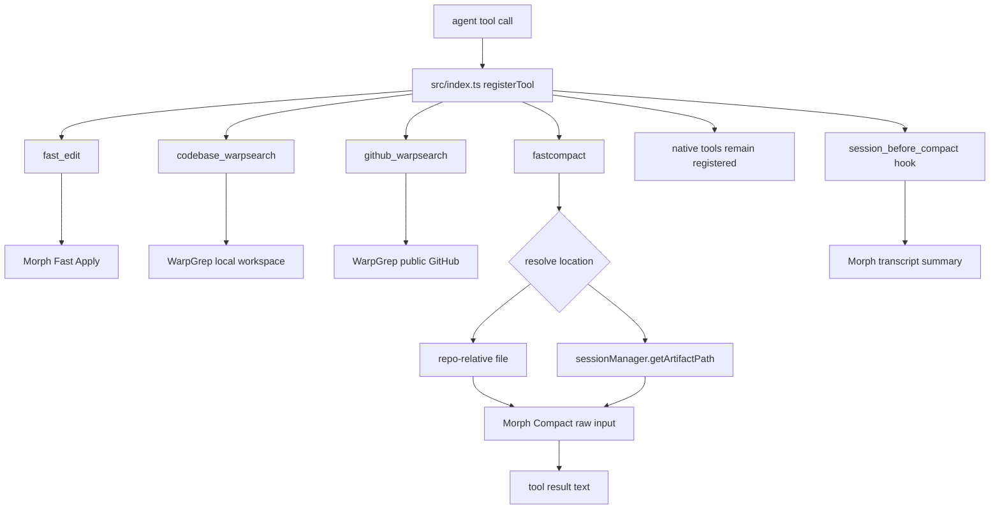

# feat: Add Morph custom tool names and fastcompact

## Summary

Expose Morph capabilities as additive omp extension tools named `fast_edit`, `codebase_warpsearch`, `github_warpsearch`, and `fastcompact`. Native system tools stay available and distinct. `fastcompact` compacts caller-provided file or artifact locations and returns text only, separate from the existing session compaction hook.

---

## Problem frame

The current plugin exposes `morph_edit`, `warpgrep_codebase_search`, and `warpgrep_github_search`. The requested user-facing surface is shorter and should behave like first-class custom tools without shadowing built-in tools such as native `edit`, `write`, or search. The repo also has Morph session compaction through `session_before_compact` and `/morph-compact`, but it does not yet provide a tool that compacts a specific file or artifact supplied by location.

---

## Requirements

Tool surface:

- R1. Register additive extension tools named `fast_edit`, `codebase_warpsearch`, `github_warpsearch`, and `fastcompact` without registering any built-in system tool name.
- R2. Use a clean cutover from the current Morph tool names to the new names across registration, routing hints, tool descriptions, docs, and tests.
- R3. Keep native omp tools as explicit fallbacks in routing copy and failure messages.
- R4. Keep tools registered when `MORPH_API_KEY` is missing and return setup guidance instead of hiding the tools.

Location compaction:

- R5. `fastcompact` accepts a default single `location` and a separate multi-location `locations` shape; each location resolves to a repo-relative file path or an `artifact://<id>` locator.
- R6. `fastcompact` reads inputs, calls Morph Compact with raw string input, and returns compacted text only.
- R7. `fastcompact` never writes to disk, overwrites inputs, saves artifacts, or mutates session history.
- R8. `fastcompact` bounds input size and location count before calling Morph, rejects directories and globs, and returns a clear error for missing files or unknown artifacts.

Agent access and docs:

- R9. Document the recommended agent allowlists: write-capable agents get all Morph tools; read-only agents get `codebase_warpsearch` and `github_warpsearch` only.
- R10. Preserve the existing `session_before_compact` hook and `/morph-compact` command as transcript compaction surfaces.

---

## Key technical decisions

- Use `fast_edit`, not `edit`: literal `edit` risks built-in tool collision. The custom-tool loader and extension registry are separate surfaces, so the safe invariant is to avoid built-in names entirely.
- Use clean rename rather than hidden aliases: the project is still at `0.1.0`, and keeping old names doubles the routing and test surface. If compatibility becomes required later, add aliases deliberately in a separate plan.
- Keep `fastcompact` separate from transcript compaction: `fastcompact` compacts supplied locations. `session_before_compact` and `/morph-compact` continue to compact conversation history.
- Use the existing compact client path: `src/compaction.ts` already uses the shared Morph Compact client. `fastcompact` should reuse that client now and defer a broader migration to the unified `MorphClient.compact` API.
- Pass raw string input to Morph Compact: the SDK accepts `CompactInput.input` as a string. For file and artifact text, pass `input`, optional `query`, `compressionRatio`, and `preserveRecent: 0`; do not build message arrays.
- Treat agent allowlists as external configuration: this plugin can register tools and document recommended allowlists, but it does not own every agent manifest.

---

## High-level technical design

`fastcompact` shares the Morph Compact backend with transcript compaction but not its entry path or output semantics. It reads location content, compacts each resolved input, and returns compacted text. It does not call `ctx.compact()` and does not write the compacted result anywhere.

---

## Implementation units

### U1. Rename visible Morph tool surface

- Goal: Replace current Morph extension tool names with `fast_edit`, `codebase_warpsearch`, and `github_warpsearch` while preserving native tools.
- Requirements: R1, R2, R3, R4.
- Dependencies: none.
- Files: `src/index.ts`, `src/routing.ts`, `src/tools/morph-edit.ts`, `src/tools/warpgrep.ts`, `test/morph.test.ts`, `README.md`, `docs/morph-tools.md`, `CHANGELOG.md`.
- Approach: Update tool `name`, `label`, descriptions, runtime notes, routing hint text, and missing-key guidance to use the new names. Keep native `edit`, `write`, and search references as fallbacks. Do not retain hidden registrations for old names in this cutover.
- Patterns to follow: Current `ToolDefinition` factory shape in `src/tools/morph-edit.ts` and `src/tools/warpgrep.ts`; registration wiring in `src/index.ts`; routing note switch in `src/routing.ts`.
- Test scenarios:
  - Registering the plugin yields `fast_edit`, `codebase_warpsearch`, and `github_warpsearch` instead of the old names.
  - Registered tool names are disjoint from known built-ins such as `edit`, `write`, `read`, `search`, `find`, `bash`, and `eval`.
  - `MORPH_EDIT=false`, `MORPH_WARPGREP=false`, and `MORPH_WARPGREP_GITHUB=false` disable only the matching renamed tools.
  - Missing-key execution for each renamed tool still returns setup guidance and native fallback text.
  - Existing execute-path tests for edit, local search, and GitHub search pass through the renamed tools.
- Verification: `test/morph.test.ts` covers registration, flags, routing copy, missing-key behavior, and representative execute paths for all renamed tools.

### U2. Add location-based `fastcompact`

- Goal: Add a non-mutating tool that compacts one or more supplied file or artifact locations and returns text.
- Requirements: R1, R4, R5, R6, R7, R8, R10.
- Dependencies: U1 for final naming and routing conventions.
- Files: `src/tools/fastcompact.ts`, `src/index.ts`, `src/config.ts`, `src/routing.ts`, `src/compaction.ts`, `test/morph.test.ts`.
- Approach: Create a `makeFastCompact(pi)` factory with `approval: "read"`. The schema accepts either `location` for the default single-input mode or `locations` for multi-input mode, plus optional `query` and `compression_ratio`. Resolve repo paths with `resolveFilepath` and artifact locators through `ctx.sessionManager.getArtifactPath`. Reject ambiguous calls, directories, globs, empty content, unknown artifacts, and oversize inputs before any Morph API call. Call Morph Compact with raw string `input`, optional `query`, resolved `compressionRatio`, and `preserveRecent: 0` for each location. Return labeled sections for multi-location output.
- Patterns to follow: `textToolResult`, `compactResultText`, and `formatCompressionPercent` from `src/compaction.ts`; abort handling from `src/tools/morph-edit.ts` and `src/tools/warpgrep.ts`; path confinement from `src/format.ts`.
- Test scenarios:
  - `fastcompact` remains registered without `MORPH_API_KEY` and returns setup guidance without calling Morph.
  - A local file path is read, sent to Morph as raw `input`, compacted with `preserveRecent: 0`, and returned as text.
  - The input file bytes are identical before and after a successful compact.
  - A call with non-default `query` and `compression_ratio` forwards `input`, `query`, `compressionRatio`, and `preserveRecent: 0` to Morph.
  - `artifact://<id>` resolves through `ctx.sessionManager.getArtifactPath` and compacts the resolved artifact file.
  - Unknown artifact ids, missing files, directories, globs, absolute paths, and root escapes return clear errors with no Morph call.
  - Empty files and empty resolved artifacts return a preflight error and do not call Morph.
  - `locations` compacts multiple inputs in order and labels each output section.
  - Passing both `location` and `locations`, or passing neither, returns a validation error.
  - Oversize inputs and too many locations return a preflight error before the SDK call.
  - `MORPH_FASTCOMPACT=false` removes only `fastcompact`; `MORPH_COMPACT=false` still removes only the transcript compaction hook and `/morph-compact` command.
  - Aborting before or after the Morph call rejects rather than returning a successful tool result.
- Verification: `test/morph.test.ts` proves the no-mutation invariant, artifact resolution, single and multi input modes, missing-key behavior, flag independence, and abort behavior.

### U3. Document agent exposure and tool policy

- Goal: Make the new names and access rules discoverable to users and agent authors.
- Requirements: R3, R4, R9, R10.
- Dependencies: U1 and U2.
- Files: `README.md`, `docs/morph-tools.md`, `CHANGELOG.md`, `package.json`.
- Approach: Update tool tables, configuration tables, and selection policy to use `fast_edit`, `codebase_warpsearch`, `github_warpsearch`, and `fastcompact`. Add `MORPH_FASTCOMPACT` to configuration docs. Distinguish `fastcompact` from `/morph-compact` and `session_before_compact`. State that tool registration is not the same as agent manifest exposure, and document recommended allowlists for write-capable and read-only agents.
- Patterns to follow: Existing README configuration table and `docs/morph-tools.md` first-action policy.
- Test scenarios: Test expectation: none for prose-only docs; the behavioral coverage belongs to U1 and U2.
- Verification: Documentation contains no stale old tool names except in changelog migration notes, and examples use only repo-relative or tool locator syntax.

---

## Scope boundaries

In scope:

- Rename the current Morph tool surface to the chosen additive names.
- Add `fastcompact` for file and artifact location compaction.
- Keep missing-key guidance instead of unregistering tools.
- Update docs and tests for the new tool names and compaction contract.

Deferred to follow-up work:

- Hidden backward-compatible aliases for the old tool names.
- Moving the Morph tools into omp core as first-party built-ins.
- Migrating existing transcript compaction from `CompactClient` to `MorphClient.compact`.
- Automatic edits to external user agent manifests.
- Directory, glob, URL, or raw-inline-text inputs for `fastcompact`.

Out of scope:

- Replacing or shadowing native `edit`, `write`, read, or search tools.
- Changing the existing `session_before_compact` semantics.
- Writing compacted file or artifact output to disk.
- Morph account setup or API-key issuance flows.

---

## System-wide impact

This is an agent-tool surface change. Agent behavior will change because tool names in prompts, manifests, docs, and tests must align. The extension registry is global for a session, while agent access is governed by each agent's tool allowlist and approval policy. The plan therefore documents allowlist expectations instead of pretending the plugin can enforce every agent profile.

The new `fastcompact` tool is read-class and remote-backed. It can leak file or artifact contents to Morph if path resolution is wrong, so it must reuse existing workspace containment and artifact lookup primitives before any API call.

---

## Risks and dependencies

- Name drift: stale references to old tool names in descriptions or routing hints would mislead the model. U1 treats copy updates as behavioral work, not docs polish.
- Built-in shadowing: a literal `edit` registration could hide or conflict with native tooling. R1 and U1 include a disjoint-name test.
- Artifact lookup: `ctx.sessionManager.getArtifactPath` can return `null`; unknown artifact ids must fail cleanly.
- Input cost and timeout: large files or many locations can cause expensive or slow remote calls. U2 requires preflight bounds.
- Approval mismatch: `fastcompact` does not mutate data, but the selected agent scope keeps it out of read-only agents by allowlist guidance rather than by approval tier.
- SDK defaults: Morph Compact defaults `preserveRecent` to `2`; U2 requires `preserveRecent: 0` for raw file and artifact text.

---

## Acceptance examples

- AE1. Given `MORPH_API_KEY` is unset, when an agent calls `fast_edit`, `codebase_warpsearch`, `github_warpsearch`, or `fastcompact`, then the tool remains available and returns setup guidance rather than throwing.
- AE2. Given all Morph feature flags are enabled, when the plugin loads, then it registers the four new Morph tool names and none of the native built-in names.
- AE3. Given a repo-relative file path with text content, when `fastcompact` is called with `location`, then Morph receives the raw file text and the tool returns compacted text without modifying the file.
- AE4. Given two valid locations, when `fastcompact` is called with `locations`, then the output preserves input order and labels each compacted section.
- AE5. Given an unknown artifact id, when `fastcompact` is called with `artifact://<id>`, then the tool returns a clear lookup error and does not call Morph.

---

## Sources and research

- `src/index.ts`: current extension registration surface for tools, routing hook, compaction hook, and `/morph-compact`.
- `src/tools/morph-edit.ts`: current write-tier Morph edit factory and missing-key behavior.
- `src/tools/warpgrep.ts`: current local and GitHub WarpGrep factories, search schemas, and abort handling.
- `src/compaction.ts`: current Morph Compact bridge and exported result helpers.
- `src/config.ts`: current feature flag and compaction ratio conventions.
- `src/routing.ts`: current routing hint and runtime note generation.
- `test/morph.test.ts`: current fake extension API, registration assertions, execute-path tests, and feature-flag coverage.
- `docs/morph-tools.md`: current tool-selection policy and manifest exposure warning.
- `node_modules/@morphllm/morphsdk/dist/tools/compact/types.d.ts`: `CompactInput.input`, `query`, `compressionRatio`, and `preserveRecent` contract.
- `node_modules/@oh-my-pi/pi-coding-agent/dist/types/session/session-manager.d.ts`: artifact path lookup through `getArtifactPath`.
